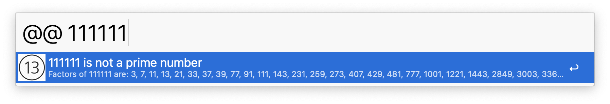
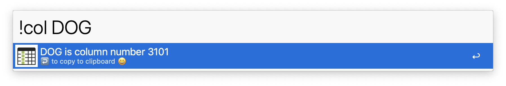

# alfred-forum 💬
 quick workflows in response to threads on the Forum

---------
## 21. Pass arguments to equation
In response to this [thread](https://www.alfredforum.com/topic/20050-outputnotifify-from-python-script-result/) (March 2023)
_I am trying to run a simple python script to out the result of an equation (e.g.  'mult 2 3') and I want to see the result._

## 20. Fetch API

In response to this [thread](https://www.alfredforum.com/topic/19367-trying-to-parse-a-json-to-alfred-search-results/) (Nov 2022)

- Retrieve API information from `https://api.short.io` using the `requests` package
- default keyword: `tttt`

[Download](https://github.com/giovannicoppola/alfred-forum/raw/main/workflows/fetchAPI.alfredworkflow)

## 19. Greek Letters

In response to this [thread](https://www.alfredforum.com/topic/19176-quickly-access-special-characters-eg-greek-%CE%B2-%CE%B1-etc/#comment-99868) (Oct 2022)

Set a keyword to enter special characters (e.g. Greek letters).
See also [snippets](https://github.com/giovannicoppola/alfred-forum/raw/main/workflows/Greek%20Letters.alfredsnippets).

[Download](https://github.com/giovannicoppola/alfred-forum/raw/main/workflows/Greek%20Letters.alfredworkflow)

## 18. Pop Coupon
In response to this [thread](https://www.alfredforum.com/topic/18657-popping-out-a-coupon-from-a-list/#comment-97128) (July 2022)

_I'd like a workflow that pops the first one and outputs it (of course deleting it from the list). 
something like: I'm writing an email and I type ".coupon" and I have in my email the actual coupon pasted, and that one is no longer in my list of available coupons_

- set the `myCouponFile` variable using the file picker. 
- use either by entering the `.coupon` keyword in Alfred, or automatically by typing `.coupon` in your document. 

[Download](https://github.com/giovannicoppola/alfred-forum/raw/main/workflows/popCoupon0-2.alfredworkflow)

## 17. URL checker
In response to this [thread](https://www.alfredforum.com/topic/18552-i-want-to-create-a-simple-workflow-actually-no-search/) (July 2022)

- Open URL in clipboard if the URL contains 2 words.
- Example: (keyword: `urlcheck`) will open the URL in your clipboard only if contains the words `boris` and `resigns`  😉

[Download](https://github.com/giovannicoppola/alfred-forum/raw/main/workflows/URLcheck.alfredworkflow)

## 16. New Note
Response to thie [thread](https://www.alfredforum.com/topic/18487-create-note-in-notesapp/#comment-96306) (June 2022)

- Create new Apple Notes note. 
- Type keyword (default: `nnn`) followed by text

[Download](https://github.com/giovannicoppola/alfred-forum/raw/main/workflows/newNote.alfredworkflow)

## 15. Smart Folder by Tag
in response to [thread](https://www.alfredforum.com/topic/11971-create-smart-folders-by-tag-file-action/?do=findComment&comment=95916) (May 2022) 

Original by @dfay

- Select a folder & launch the file action -- it will identify every tag that's used on any file in the folder, and create a corresponding smart folder.  Minimally adapted from http://leancrew.com/all-this/2018/10/a-little-tagging-automation/

[Donwnload](https://github.com/giovannicoppola/alfred-forum/raw/main/workflows/SmartFolderByTag.alfredworkflow)

## 14. Rename Subtitle

In response to this [thread](https://www.alfredforum.com/topic/18338-copy-one-filename-replace-another-keep-ext/)

- Usage: select your folder, then either use a hotkey (to be set in the workflow), or select "Rename Subtitle" in Universal Actions (ctrl-cmd-\).

[Download](https://github.com/giovannicoppola/alfred-forum/raw/main/workflows/Rename%20Subtitle.alfredworkflow) 

## 13. _background process
[thread](https://www.alfredforum.com/topic/18296-download-images-asynchronously-in-the-background/) (April 2022)

Example of background process

- launches a script filter that runs every second. At the first run this launches a second script in the background, which lasts 7 seconds, after which Alfred will update the output.

[Download](https://github.com/giovannicoppola/alfred-forum/raw/main/workflows/_background%20process.alfredworkflow)

## 12. Prime Checker

In response to this [thread](https://www.alfredforum.com/topic/18106-workflow-created-with-python-and-problems-with-json/#comment-93588) (March 2022): 

Enter a number and check if it is prime. If not, get factors. 

[Download](https://github.com/giovannicoppola/alfred-forum/raw/main/workflows/PrimeChecker.alfredworkflow)

## 11. ColCounter
in response to this [thread](https://www.alfredforum.com/topic/18096-find-column-number-in-excelsheetsnumbers/#comment-93552) (March 2022)

Returns the column number in a spreadsheet, given the column name

## 10. Rich-Text Clipboard URL
In response to this [thread](https://www.alfredforum.com/topic/17972-how-to-format-a-link-text-url-so-that-it-does-not-paste-with-an-extra-new-line-at-the-end/) (Feb 2022)

- Paste a rich-text URL into Google Docs without a new line

- Using an applescript found [here](https://forum.latenightsw.com/t/how-do-i-set-clipboard-pasteboard-to-both-rich-text-rtf-and-plain-text/1189)

[Download](https://github.com/giovannicoppola/alfred-forum/raw/main/workflows/RTCU.alfredworkflow)

## 9. Replace text in URL
In response to this [thread](https://www.alfredforum.com/topic/17654-workflow-to-replace-a-portion-of-copied-text/) (December 2021)

- Universal action to replace 'settings' with 'users' in selected URL

[Download](https://github.com/giovannicoppola/alfred-forum/raw/main/workflows/Replace%20Text%20in%20URL.alfredworkflow)

## 8. OpenDEVON
In response to this [thread](
https://www.alfredforum.com/topic/17043-problems-opening-devonthink-urls-with-alfred/) (June 2021)

- Open a DEVONthink PDF from the UUID

[Download](https://github.com/giovannicoppola/alfred-forum/raw/main/workflows/OpenDEVON.alfredworkflow)

## 7. Age calculator
responding to this [thread](https://www.alfredforum.com/topic/16938-age-calculator/) (May 2021)

Enter date with format YYYY-Mon-DD (e.g. 2021–May-26), get age in years/months

[Download](https://github.com/giovannicoppola/alfred-forum/raw/main/workflows/Age%20calculator_v0.2.alfredworkflow)

## 6. Kill Finder

In response to this [thread](https://www.alfredforum.com/topic/16869-little-finder-restart-keystroke/) (May 2021)

- Kills all Finder processes 

[Download](https://github.com/giovannicoppola/alfred-forum/raw/main/workflows/KillFinder.alfredworkflow)

## 5. Search with Safari incognito
In response to this [thread](https://www.alfredforum.com/topic/16866-need-help-with-safari-workflow-web-search-in-private-window/?do=findComment&comment=86593) (May 2021)

- Search Safari using a private window

[Download](https://github.com/giovannicoppola/alfred-forum/raw/main/workflows/Search%20with%20Safari%20(private%20window).alfredworkflow)

## 4. Remove Extra Spaces
Testing the new Universal Actions 

[thread](https://www.alfredforum.com/topic/17056-alfred-45-beta-take-a-first-look-at-universal-actions/?do=findComment&comment=87612) (June 2021)

- Replace the selected text with a version without extra spaces
- Replace the selected paragraph without extra lines
- Convert to ALL CAPS
- convert to lower case

[Download](https://github.com/giovannicoppola/alfred-forum/raw/main/workflows/Remove%20Extra%20Spaces.alfredworkflow)

## 3. mac vendors
In response to this [thread](https://www.alfredforum.com/topic/16856-macvendorscom-in-alfred-workflow/) (May 2021)

- Search api.macvendors.com
- Needs PHP installed

[Download](https://github.com/giovannicoppola/alfred-forum/raw/main/workflows/MAC.alfredworkflow)

## 2. Battery cycles
In response to this [thread](https://www.alfredforum.com/topic/16772-a-workflow-to-check-battery-charge-cycles/)
- Checking the battery cycles

[Download](https://github.com/giovannicoppola/alfred-forum/raw/main/workflows/battery%20cycles.alfredworkflow)

## 1. Clone-open
[thread](https://www.alfredforum.com/topic/5914-file-action-duplicate/?do=findComment&comment=85906) (April 2021)

[Download](https://github.com/giovannicoppola/alfred-forum/raw/main/workflows/Clone-Open_0-2.alfredworkflow)
